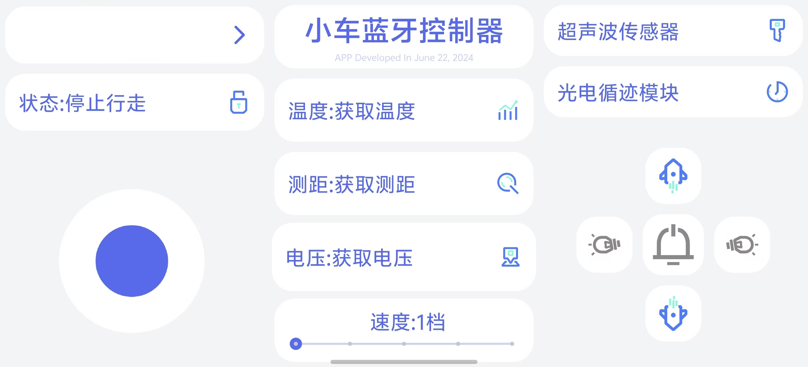

# Android-SPP-Car-Controller
🚗 本项目是一款基于 Android 蓝牙 RFCOMM 串口通信的智能小车控制 APP，通过蓝牙与下位机单片机小车建立连接，实现摇杆行走控制、多档位调速、灯光/喇叭/传感器交互，同时实时接收小车回传电压、超声波测距、温度数据并展示。
<br>
<p align='center'>
  </img>
</p>
<br>
### 功能清单
1. **蓝牙连接管理**
    - 自动读取系统已配对蓝牙设备，下拉选择设备 MAC 地址一键连接
    - 标准蓝牙串口 UUID：`00001101-0000-1000-8000-00805F9B34FB`
2. **小车运动控制**
    - 四向摇杆控制：前进/后退/左转/右转/停止
    - 行走锁定功能，锁定后摇杆失效
    - 5档速度调节（按钮±调速 + 滑动条调速双模式）
3. **外设操作**
    - 喇叭长按开启/松开关闭
    - 左右转向灯切换开关
    - 超声波传感器数据读取
    - 红外循迹模块启停
4. **数据实时回显**
    - 电池电压（mV）
    - 超声波测距（cm）
    - 两路温度数值（℃）
5. **交互体验**
    - 操作震动反馈
    - 操作弹窗提示
    - 圆角扁平化 UI 布局
    - 挖孔屏全屏适配

## 项目文件结构
```
com.example.car_control
├── bluetooth_socketMSG.java   // 蓝牙数据接收子线程
├── MainActivity.java          // 主页面逻辑、蓝牙发送、UI交互
res/layout/
├── activity_main.xml          // 主界面布局（三栏分栏UI）
└── spinner_res.xml            // 蓝牙下拉列表单项样式
```

## 核心代码模块说明
### 1. bluetooth_socketMSG.java 蓝牙接收线程
独立子线程持续监听蓝牙输入流，固定读取12字节数据包，通过 Handler 将原始字节数组抛到主线程更新UI：
- 循环阻塞读取 12 字节数据帧
- 通过 `Message.what=0x1234` 标识接收消息
- 字节数组通过 `message.obj` 传递给主线程解析

### 2. MainActivity.java 主业务逻辑
#### 2.1 蓝牙初始化
- 获取系统蓝牙适配器，校验蓝牙可用状态
- 读取已配对设备列表，填充 Spinner 下拉框
- 点击连接按钮创建 RFCOMM Socket，建立输入输出流，启动接收线程

#### 2.2 数据发送指令表
APP 向下位机发送单字节指令控制小车：
| 指令字节 | 功能说明 |
| ---- | ---- |
| 0x01 | 前进 |
| 0x02 | 停止行走 |
| 0x03 | 后退 |
| 0x04 | 右转 |
| 0x05 | 左转 |
| 0x06 | 速度+1档 |
| 0x07 | 速度-1档 |
| 0x08 | 读取超声波测距 |
| 0x09 | 开启红外循迹 |
| 0x10 | 左转向灯切换 |
| 0x11 | 右转向灯切换 |
| 0x12 | 喇叭开启 |
| 0x13 | 喇叭关闭 |
| 0x14 | 读取电池电压 |

#### 2.3 下位机回传数据解析规则
下位机固定返回12字节数据帧，字节分配：
1. 0~3：电压数据（拼接为 mV）
2. 4~7：超声波测距（拼接为 cm）
3. 8~9：温度整数位
4. 10~11：温度小数位

通过 Handler 接收字节数组，拆分拼接字符串更新对应 TextView。

#### 2.4 UI交互逻辑
- 自定义四向摇杆 `MyRockerView` 实时发送行走指令
- SeekBar 滑动条同步档位，拖动自动增减速度档位
- 所有按钮点击触发手机震动反馈
- 转向灯点击切换置灰/高亮状态

### 3. 布局文件说明
#### activity_main.xml
采用 `TableLayout` + 三分栏 `LinearLayout` 横向布局：
1. **左栏**：蓝牙选择下拉框 + 摇杆控制区
2. **中间栏**：标题、电压/测距/温度数据显示、速度滑动条
3. **右栏**：传感器按钮、加减速按钮、喇叭、左右转向灯按钮

#### spinner_res.xml
蓝牙设备下拉列表单行样式，统一文字颜色与大小。

## 部署与使用教程
### 1. 前置准备
1. Android Studio 编译项目，最低支持 Android P（API 28）
2. 手机提前与智能小车蓝牙模块完成配对
3. 下位机单片机程序需匹配 12 字节上行数据帧格式与单字节下行指令

### 2. APP操作步骤
1. 打开APP，自动开启蓝牙，无配对设备会直接退出
2. 顶部下拉框选择小车蓝牙MAC地址，点击连接图标建立蓝牙通道
3. 左侧摇杆控制小车前进、后退、转向；中间滑动条调节行驶速度
4. 右侧功能按钮：
    - 上下箭头：加减速度档位
    - 左右灯光图标：切换转向灯
    - 中间喇叭按钮：长按发声、松开静音
    - 超声波/循迹文字：触发对应传感器读取
5. 中间区域实时展示小车上传电压、距离、温度数据
6. 顶部「状态:停止行走」文字点击可锁定/解锁摇杆操作

## 已知问题与优化建议
### 当前存在缺陷
1. 蓝牙断开无自动重连逻辑，IO异常仅打印堆栈，无弹窗提示用户断连
2. 接收线程仅捕获IO异常，未做线程销毁、Socket关闭释放资源，反复连接易内存泄漏
3. 未做权限适配（Android 12+ 蓝牙扫描/连接需要动态蓝牙权限）
4. 数据解析直接强转字符，未做数值校验，下位机异常数据会导致UI乱码
5. 无数据包校验头/校验和，容易出现粘包、错包数据错乱

### 优化方向
1. 添加 Activity 生命周期 `onDestroy` 关闭 Socket、终止接收线程
2. 增加 Android 蓝牙动态权限申请（BLUETOOTH_SCAN、BLUETOOTH_CONNECT）
3. 自定义通信协议帧头+校验和，过滤脏数据
4. 蓝牙断开监听，自动弹出重连提示
5. 数据转数字解析而非字符串拼接，支持数值计算
6. 增加日志工具类，替换 `e.printStackTrace()` 方便调试

## 开发信息
- 开发时间：2024年6月22日
- 第三方摇杆库： `MyRockerView` @y141111
- 图标素材： `双色线性ICON` @Konan君
- 通信方式：蓝牙串口 RFCOMM SPP
- 适用设备：搭载蓝牙串口模块（HC-05/HC-06）的STM32/51单片机/ESP32智能小车